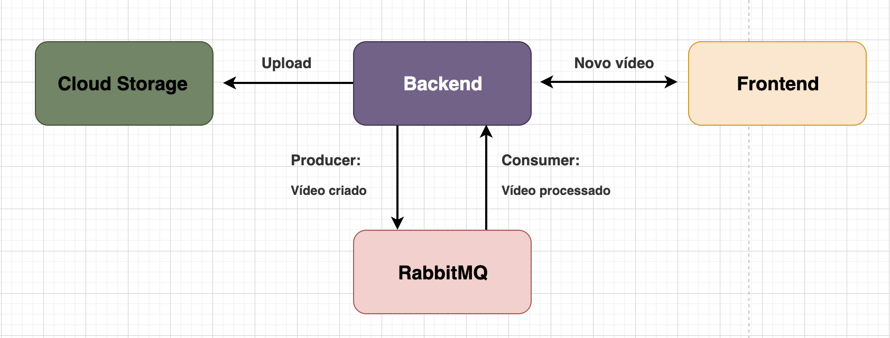
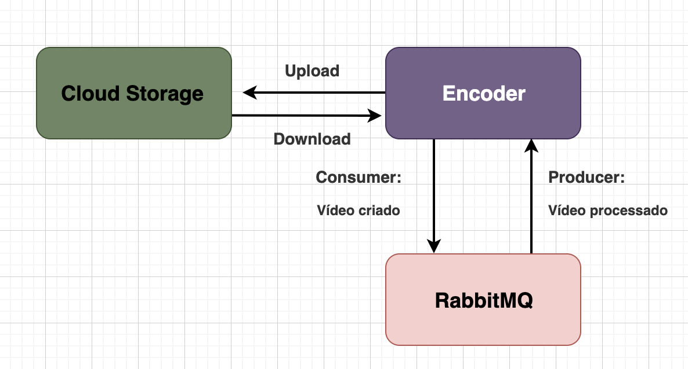

<h1 align="center"> Projeto CODEFLIX </h1>

## Descrição do Projeto 🍿

 O projeto é fazer uma Netflix, onde o usuário final terá a possibilidade de se registrar, contratar os serviços de streaming de vídeos, navegar pelo catálago, bem como reproduzir os vídeos.

### Detalhes do Projeto

- Assinatura de Serviço pelo cliente
- Catálogo de vídeos para navegação
- Playback de vídeos
- Busca full text no catálogo
- Processamento e enconding dos vídeos
- Administração do catálogo de vídeos
- Administração do serviço de assinatura
- Autenticação

## Decisões de Projeto e de Arquitetura 🎬

### Microsserviços

- Arquitetura baseada em microsserviços
- Tecnologia adequada para cada contexto
- Cada microsserviços terá seu próprio processo de CI/CD

### API Gateway

- Porta de entrada para as APIs
- Acesso externo aos microsserviços através do Ingress do Kubernetes/Istio como API Gateway
- Único ponto de acesso direto as aplicações
- Controle de tráfego
- Rate limit
- Políticas de Retry

### Service Discovery

- Não haverá a necessidade de trabalhar com um sistema de Service Discovery como "Consul"
- O projeto utilizará o Kubernetes para orquestrar os containers, logo Service Discovery já faz parte do processo

### Escala Horizontal

- O processo de escala poderá ser configurado a nível de microsserviço
- Todos os microsserviços trabalharão de forma "Stateless" sem estado
- Quando utilizado o upload de qualquer tipo de asset, o mesmo será armazenado em um Cloud Storage
- O processo de escala se dará no aumento na quantidade de PODs do Kubernetes
- O processo de autoscaling também será utilizado através de um recurso chamado HPA (Horizontal Pod Autoscaler)
- Todos os logs gerados serão persistidos em sistema externo como Prometheus e Elasticsearch

### Consistência Eventual

- Grande parte da comunicação entre os microsserviços será assíncrona
- Cada microsserviço possuirá sua própria base de dados
- Eventualmente os dados poderão ficar inconsistentes, desde que não haja prejuízo direto ao negócio

### Duplicação de Dados

- Eventualmente um microsserviço poderá persistir dados já existentes em outro microsserviço em seu banco de dados
- Essa duplicação ocorre para deixar o microsserviço mais autônomo preciso
- O microsserviço duplicará apenas os dados necessários para seu contexto

### Mensageria

- Como grande parte da comunicação entre os microsserviços é assíncrona, um sistema de mensageria é necessário
- O RabbitMQ foi escolhindo para esse caso

### Resiliência e Self Healing

- Para garantir a resiliência caso um ou mais microsserviços fiquem fora do ar, as filas serão essenciais
- Caso uma mensagem venha em um padrão não esperado para determinado microsserviço, o microsserviço poderá rejeitá-la e automaticamente a mesma poderá ser encaminhada para uma dead-letter queue
- Pelo fato do Kubernetes e Istio possuirem recursos de Circuit Breaker e Liveness e Readiness probes:
  - Se um container tiver um crash, automaticamente ele será reiniciado ou mesmo recriado
  - Caso um container não aguente determinado tráfego, temos a opção de trabalhar com Circuit Breaker para impedir que ele receba mais requisições enquanto está se "curando"

### Autenticação

- Serviço centralizado de identidade opensource: Keycloak
- OpenID Connect
- Customização do tema
- Compartilhamento de chave pública com os serviços para verificação de autenticidade dos tokens
- Diversos tipos de ACL
- Flow de autenticação para FRONTEND e BACKEND

## Microsserviços do Projeto 📽

Admin Catálogo de Vídeo

- (Backend com Laravel)
- (Frontend com React)

Encoder e Vídeo - Winehouse

- (Backend com Golang)

API do Catálogo

- (Backend com Node.js)
- (Frontend com React)

Assinatura do CODEFLIX pelo cliente

- (Backend Python com Django)

Autenticação entre Microsserviços

- (Keycloak)

Comunicação assíncrona entre os Microsserviços

- (RabbitMQ)

### Dinâmica dos Microsserviços

> Catálogo de Vídeo

  

> Encoder de Vídeo

  

> API/App do Catálogo

  

